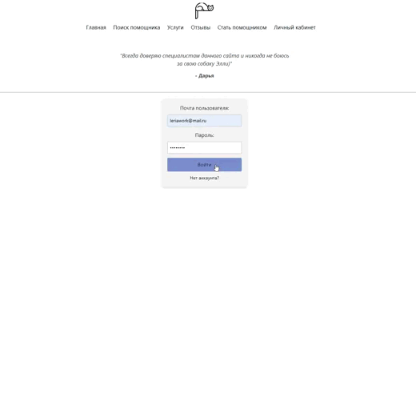

Full-stack веб-сервис для поиска исполнителей по уходу за домашними животными. Проект демонстрирует полный цикл создания веб-приложения.

### Демонстрация работы сайта


## 🚀 О проекте
В современном мире многие владельцы домашних животных сталкиваются с проблемой поиска надежного человека, который мог бы присмотреть за их питомцем во время отпуска, командировки или просто плотного рабочего дня. Существующие решения часто разрознены и не предоставляют единой системы оценки и отзывов.

Это приложение было создано, чтобы решить данную проблему. Оно представляет собой централизованную платформу, которая позволяет:
*   **Владельцам животных** - быстро находить проверенных специалистов по уходу (работников) с помощью удобных фильтров.
*   **Работникам** - предлагать свои услуги, создавать профессиональный профиль и находить клиентов.

Главная цель проекта — создать безопасную, удобную и доверительную среду для взаимодействия между владельцами питомцев и исполнителями услуг.

---

## ✨ Ключевые возможности

### Для владельцев питомцев:
*   ✅ **Регистрация и авторизация** в системе.
*   📝 **Создание и управление анкетами** своих питомцев с подробной информацией (порода, возраст, привычки, медицинские особенности).
*   🔍 **Многоуровневый поиск ситтеров** с гибкой системой фильтров (геолокация, тип услуги, даты, параметры питомца, стоимость).
*   📄 **Просмотр подробных анкет** исполнителей с их опытом, календарем занятости, отзывами и рейтингом.
*   📅 **Система бронирования услуг** с возможностью отслеживания статуса заказа («в ожидании», «подтвержден», «завершен»).
*   ⭐ **Возможность оставлять оценки и текстовые отзывы** по завершении услуги для формирования рейтинга ситтера.

### Для работников (исполнителей):
*   ✅ **Регистрация в качестве исполнителя** через многошаговую форму.
*   🛠️ **Создание и редактирование профессионального профиля** с указанием опыта, предлагаемых услуг, цен и загрузкой фотографий.
*   📥 **Получение и обработка входящих заказов** с возможностью подтвердить или отклонить заявку.
*   🗓️ **Просмотр своего календаря** для управления занятостью.

---
## 🛠️ Технологический стек
Проект построен на основе трехуровневой архитектуры (клиент-сервер-база данных) с использованием современных технологий.

*   **Frontend (Клиентская часть):**
    *   [**React**](https://reactjs.org/) - для построения пользовательского интерфейса.
    *   [**JavaScript (ES6+)**](https://developer.mozilla.org/ru/docs/Web/JavaScript)
    *   [**Axios**](https://axios-http.com/) - для взаимодействия с REST API.
    *   [**React Router**](https://reactrouter.com/) м для навигации по приложению.
    *   **HTML5 & CSS3**

*   **Backend (Серверная часть):**
    *   [**Node.js**](https://nodejs.org/) - среда выполнения JavaScript.
    *   [**Express.js**](https://expressjs.com/ru/) - для создания REST API.
    *   [**Sequelize**](https://sequelize.org/) - ORM для взаимодействия с базой данных.
    *   [**JWT (JSON Web Tokens)**](https://jwt.io/) - для реализации системы аутентификации.

*   **Database (База данных):**
    *   [**PostgreSQL**](https://www.postgresql.org/) - в качестве реляционной СУБД.

---

## ⚙️ Установка и запуск

Для запуска проекта на вашем компьютере выполните следующие шаги. Вам понадобится два окна терминала.

1.  **Клонируйте репозиторий на свой компьютер:**
    ```bash
    git clone https://github.com/valeriasur/petsitting-site.git
    cd petsitting-site
    ```

2.  **Установите зависимости для Backend и Frontend:**
    *(эту команду нужно выполнить один раз перед первым запуском)*
    ```bash
    # Установка для серверной части
    cd backend
    npm install
    cd ..

    # Установка для клиентской части
    cd frontend
    npm install
    cd ..
    ```
    *Не забудьте создать файл `.env` в папке `backend` по примеру `.env.example` и указать свои данные для подключения к базе данных PostgreSQL и секретные ключи.*

3.  **Запустите проект:**

    *   **В первом окне терминала** запустите Backend (сервер):
        ```bash
        cd petsitting-site/backend
        npm start
        ```
        Сервер запустится по адресу `http://localhost:5000`.

    *   **Во втором окне терминала** запустите Frontend (клиент):
        ```bash
        cd petsitting-site/frontend
        npm start
        ```
        Сайт автоматически откроется в вашем браузере по адресу `http://localhost:3000`.

---
